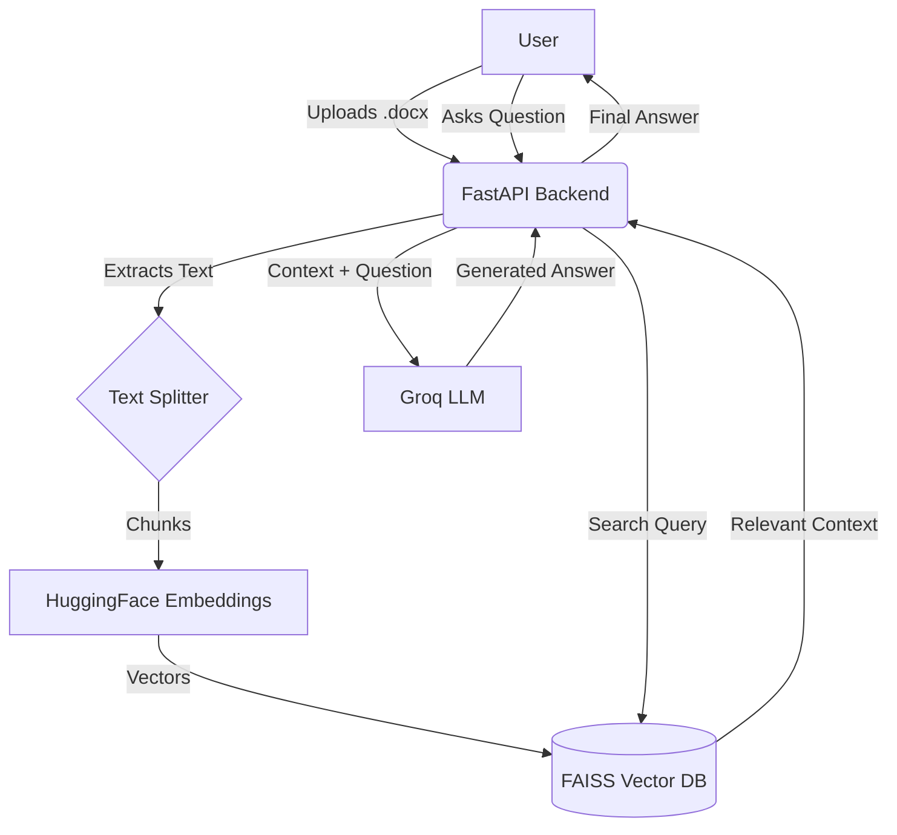

# GenRAG: Intelligent Document Retrieval & Chat System

GenRAG is a high-performance Retrieval-Augmented Generation (RAG) application that allows users to upload documents and interact with them using AI. It leverages state-of-the-art Large Language Models (LLMs) and vector databases to provide accurate, context-aware answers based on your private data.

## 🚀 Features
- **Document Upload**: Seamlessly upload `.docx` files to create a personalized knowledge base.
- **Intelligent RAG Pipeline**: Uses LangChain and FAISS for efficient document indexing and similarity search.
- **FastAPI Backend**: A robust and scalable API powered by Python.
- **Modern Frontend**: A responsive UI built with Next.js and Tailwind CSS.
- **AI Integration**: Powered by Groq (Mixtral-8x7b) for lightning-fast responses.

## 🛠️ Tech Stack
- **Frontend**: Next.js 14, Tailwind CSS, Axios
- **Backend**: FastAPI, Python 3.10+
- **AI/ML**: LangChain, ChatGroq, HuggingFace Embeddings (all-MiniLM-L6-v2)
- **Vector DB**: FAISS (Facebook AI Similarity Search)

## 🔄 Project Flow
The following diagram explains how data flows through the system:

## 🏗️ Getting Started

### Backend Setup
1. Navigate to `backend/`
2. Create a virtual environment: `python -m venv venv`
3. Install dependencies: `pip install -r requirements.txt`
4. Create a `.env` file and add your `GROQ_API_KEY`.
5. Run the server: `python main.py`

### Frontend Setup
1. Navigate to `frontend/`
2. Install dependencies: `npm install`
3. Run the development server: `npm run dev`

## 📝 Flow Summary for Explanation
1. **Indexing**: When a document is uploaded, it's broken into smaller pieces (chunks). These chunks are converted into mathematical vectors (embeddings) and stored in a searchable database (FAISS).
2. **Retrieval**: When you ask a question, the system finds the most relevant chunks from your document by comparing the "math" of your question to the vectors in the database.
3. **Generation**: The retrieved context is sent to the AI (Groq), which uses the specific information from your document to answer your question accurately.
